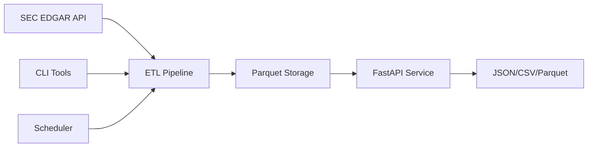

# 🏦 SEC Financial Data Pipeline

> **Production-ready financial data platform for SEC EDGAR filings with real-time API access**

[](https://python.org)
[](https://fastapi.tiangolo.com)
[](https://www.sec.gov/edgar)
[](LICENSE)
[](Dockerfile)

## 🎯 **What This Solves**

Transform complex SEC filing data into clean, accessible financial insights for:

- **Investment Research & Analysis** 📈
- **Financial Dashboard Development** 🖥️
- **Regulatory Compliance & Reporting** 📊
- **Data Science & Machine Learning** 🤖

## ✨ **Key Features**

🚀 **Automated ETL Pipeline**

- Incremental data processing with change detection
- SEC-compliant rate limiting (10 req/sec)
- Supports 10,000+ companies and financial metrics
- Parquet-based storage for optimal performance

⚡ **High-Performance API**

- Sub-second response times with intelligent caching
- Multiple output formats: JSON, CSV, Parquet
- Comprehensive financial data endpoints
- Real-time company comparisons

🏗️ **Production-Ready Architecture**

- Docker containerization with health checks
- Monitoring and observability built-in
- Comprehensive error handling and logging
- Extensible design for custom analysis

## 🚀 **Quick Start**

### **1. Installation**

```bash
git clone https://github.com/jasonwu001t/sec-financial-pipeline.git
cd sec-financial-pipeline

# Create virtual environment
python -m venv venv
source venv/bin/activate  # On Windows: venv\Scripts\activate

# Install dependencies
pip install -r requirements.txt
```

### **2. Initialize System**

```bash
# Setup and fetch sample data
python scripts/setup.py

# Fetch financial data for companies
python scripts/run_etl.py fetch AAPL
python scripts/run_etl.py fetch TSLA
```

### **3. Start API Server**

```bash
uvicorn src.api.main:app --host 0.0.0.0 --port 8000 --reload
```

**🎉 API now available at: http://localhost:8000**

**📚 Interactive docs: http://localhost:8000/docs**

## 📊 **Usage Examples**

### **ETL Data Management**

```bash
# Fetch individual companies
python scripts/run_etl.py fetch NVDA

# Bulk fetch S&P 500 companies
python scripts/run_etl.py incremental --tickers "MSFT,GOOGL,META"

# Daily incremental updates
python scripts/run_etl.py daily

# Check system status
python scripts/run_etl.py status
```

### **API Usage**

```bash
# System health check
curl http://localhost:8000/status

# Get company financial data
curl "http://localhost:8000/financials/AAPL"

# Specific metrics with filters
curl "http://localhost:8000/financials/AAPL/revenue?years=5"

# Export to CSV
curl "http://localhost:8000/financials/TSLA?format=csv&years=3"

# Compare multiple companies
curl "http://localhost:8000/financials/compare?tickers=AAPL,MSFT&metric=revenue"
```

### **Python Integration**

```python
import requests
import pandas as pd

# Fetch financial data
response = requests.get("http://localhost:8000/financials/AAPL/revenue?years=5")
data = response.json()

# Convert to pandas DataFrame
df = pd.json_normalize(data['data'])
print(df[['value', 'fiscal_year']])
```

## 🏗️ **Architecture**

```
📁 sec-financial-pipeline/
├── 🔧 src/
│   ├── 📊 etl/           # Data pipeline & processing
│   ├── 🌐 api/           # FastAPI application
│   ├── 🏗️ core/          # Core models & SEC client
│   └── 🛠️ utils/         # Shared utilities
├── ⚙️ config/            # Configuration files
├── 🐳 docker/            # Docker deployment
├── 📜 scripts/           # CLI management tools
└── 📁 data/              # Parquet data storage
```

### **Data Flow**



## 🚀 **Deployment**

### **Docker Deployment**

```bash
# Build and run
docker build -t sec-financial-pipeline .
docker run -p 8000:8000 sec-financial-pipeline

# Or use docker-compose
docker-compose up -d
```

### **Production Deployment**

```bash
# With Gunicorn
gunicorn src.api.main:app -w 4 -k uvicorn.workers.UvicornWorker

# Set up daily ETL cron job
0 2 * * * cd /path/to/project && python scripts/run_etl.py daily
```

## 📈 **Financial Data Available**

### **Income Statement**

- Revenue, Cost of Revenue, Gross Profit
- Operating Income, Net Income
- EPS (Basic & Diluted), Share Counts
- R&D, Sales & Marketing Expenses

### **Balance Sheet**

- Assets (Current & Non-current)
- Liabilities & Shareholders' Equity
- Cash, Inventory, Property & Equipment
- Debt levels & Working Capital

### **Cash Flow Statement**

- Operating, Investing, Financing Activities
- Capital Expenditures, Acquisitions
- Dividends, Stock Repurchases
- Free Cash Flow Components

### **Key Ratios & Metrics**

- Profitability: ROA, ROE, Margins
- Liquidity: Current Ratio, Quick Ratio
- Efficiency: Asset Turnover, Inventory Turns
- Growth: Revenue, Earnings Growth Rates

## 🔧 **Configuration**

Key settings in `config/config.yaml`:

```yaml
sec_api:
  rate_limit_requests_per_second: 10
  user_agent: "sec-financial-pipeline/1.0 (jasonwu001t@gmail.com)"

data_storage:
  base_path: "./data/company_facts"
  format: "parquet"

api:
  host: "0.0.0.0"
  port: 8000
  cache_ttl: 3600
```

## 🤝 **Contributing**

1. Fork the repository
2. Create feature branch (`git checkout -b feature/amazing-feature`)
3. Commit changes (`git commit -m 'Add amazing feature'`)
4. Push to branch (`git push origin feature/amazing-feature`)
5. Open Pull Request

## 📄 **License**

This project is licensed under the MIT License - see the [LICENSE](LICENSE) file for details.

## 🙏 **Acknowledgments**

- **SEC.gov** for providing free access to financial data
- **FastAPI** for the excellent web framework
- **Pandas & PyArrow** for data processing capabilities
- **Pydantic** for data validation and serialization

## 📞 **Support**

- 📖 **Documentation**: [README_PIPELINE.md](README_PIPELINE.md)
- 🐛 **Issues**: [GitHub Issues](https://github.com/jasonwu001t/sec-financial-pipeline/issues)
- 💬 **Discussions**: [GitHub Discussions](https://github.com/jasonwu001t/sec-financial-pipeline/discussions)

---

**⭐ If this project helps you, please give it a star!**
